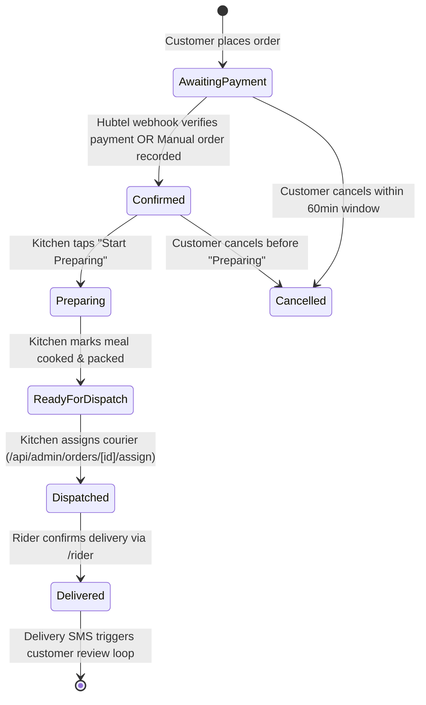
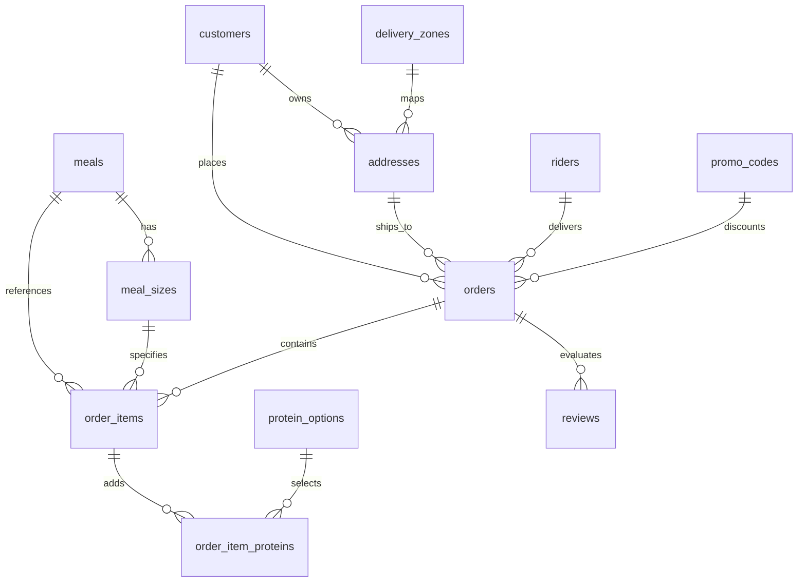

# Chef Apedo Foods — System Architecture

## Status
Tech stack and architecture are **locked and production-implemented**. This document captures the system shape, data model, payment architecture, messaging pipeline, and logistics workflows.

---

## 1. Technology Stack

| Layer | Technology | Purpose & Implementation Details |
|:---|:---|:---|
| **Frontend Framework** | **Next.js 14+ (App Router)** | Full-stack application unifying customer storefront, real-time KDS, and mobile rider portal. |
| **Language** | **TypeScript 5.0+** | Strict typing across database models, API payloads, and cart calculations. |
| **Styling** | **Tailwind CSS 3.4+** | Mobile-first, responsive dark/light thematic tokens (`#141414`, `#18110E`, `#FFB800`). |
| **Database & Auth** | **Supabase (PostgreSQL 15)** | Row Level Security (RLS), Supabase Auth for staff, and Realtime WebSocket subscriptions. |
| **Hosting & Edge** | **Vercel** | Edge runtime for API routes, automated branch deployments, and asset caching. |
| **Payments** | **Hubtel API + Manual MoMo** | Dual-lane: Hubtel for online mobile money/cards, with manual merchant MoMo/Cash on Delivery. |
| **Messaging** | **Agoo SMS Gateway** | High-throughput Ghanaian transactional SMS (`X-API-Key` auth, single & concurrent broadcast). |
| **Mapping & Location** | **Leaflet / OpenStreetMap** | Dynamic GPS coordinate pin-dropping and campus landmark address resolution. |

---

## 2. Global System Topology

```
                              STUDENT / CUSTOMER
                                      │
                         (Phone / Browser / Leaflet GPS)
                                      │
                                      ▼
                        ┌───────────────────────────┐
                        │          VERCEL           │
                        │    Next.js Application    │
                        │ ───────────────────────── │
                        │  • Storefront UI          │
                        │  • Realtime KDS UI        │
                        │  • Rider Dispatch Portal  │
                        │  • REST API Route Handlers│
                        └─────────────┬─────────────┘
                ┌─────────────────────┼─────────────────────┐
                ▼                     ▼                     ▼
      ┌──────────────────┐  ┌──────────────────┐  ┌──────────────────┐
      │     SUPABASE     │  │   HUBTEL / MOMO  │  │     AGOO SMS     │
      │ • PostgreSQL 15  │  │ • MoMo (MTN/Tel) │  │ • Dispatch Alerts│
      │ • Row Level Sec  │  │ • Webhook Events │  │ • Tracking Links │
      │ • Realtime WS    │  │ • Card Gateway   │  │ • Review Links   │
      │ • Service Role   │  │                  │  │ • Mass Blasts    │
      └──────────────────┘  └──────────────────┘  └──────────────────┘
```

---

## 3. Order Lifecycle & State Machine



### Automated SMS Notification Triggers:
1. **On Dispatch (`dispatched`):** System dispatches an instant Agoo SMS to customer's Ghana phone with a direct link to live GPS tracking (`/order/[id]`).
2. **On Delivery (`delivered`):** System fires a thank-you SMS containing a dedicated review link (`/feedback/[orderId]`).

---

## 4. Payment Architecture (Dual-Lane)

Chef Apedo operates a **dual-lane payment model** where food prepayment is isolated from physical courier fees:

```
Option A: Hubtel Online Prepayment (Instant MoMo / Card)
  Order created → Order.order_status = 'awaiting_payment'
        ↓
  Redirected to Hubtel Hosted Checkout (/api/payments/hubtel)
        ↓
  Student approves MoMo prompt on MTN, Telecel, or ATMoney
        ↓
  Hubtel webhook fires to /api/webhooks/hubtel
        ↓
  Server verifies responseCode === '0000' or status === 'Success'
        ↓
  Order.payment_status = 'paid', Order.order_status = 'confirmed'
        ↓
  KDS displays green "PAID" badge

Option B: Manual MoMo / Cash on Delivery
  Order created via /api/orders/manual
        ↓
  Order.order_status = 'awaiting_payment', Order.payment_status = 'unpaid'
        ↓
  Student sees merchant line number instructions and Cash on Delivery breakdown
        ↓
  Rider or Admin collects funds
        ↓
  Tapping "Mark as Received" or Rider "Collect Payment" sets:
  Order.payment_collected = TRUE & Order.payment_status = 'paid'
```

> [!IMPORTANT]
> **Hard Product Requirement:** "Food Prepayment" and "Courier Delivery Fee" are never summed into a single charge. Customers pay for meals online/direct to secure kitchen prep, and pay couriers upon doorstep delivery.

---

## 5. Logistics & Rider Portal Flow (`/rider`)

```
                  Rider logs in via authorized phone number
                                     │
                                     ▼
                  Rider Dashboard fetches assigned orders
                       (status === 'dispatched')
                                     │
                                     ▼
                ┌─────────────────────────────────────────┐
                │ 1-Tap Google Maps GPS Directions        │
                │ 1-Tap Direct Customer Phone Call (tel:) │
                └────────────────────┬────────────────────┘
                                     │
                                     ▼
                       Courier arrives at hostel
                                     │
                     ┌───────────────┴───────────────┐
                     ▼                               ▼
            Order Paid Online                Order Manual/Unpaid
                     │                               │
                     │                               ▼
                     │                 Prominent "COLLECT" Button
                     │                               │
                     │                               ▼
                     │                Modal displays exact GH₵ fee
                     │                               │
                     │                               ▼
                     │                Rider confirms physical cash/MoMo
                     │                               │
                     │                 /payment-collected route sets:
                     │                 • payment_collected = TRUE
                     │                 • payment_status = 'paid'
                     │                               │
                     └───────────────┬───────────────┘
                                     │
                                     ▼
                       Rider taps "MARK DELIVERED"
                                     │
                                     ▼
                 Order closed & automated Review SMS sent
```

---

## 6. Complete Database Schema (PostgreSQL)



### Table Definitions

#### `orders`
- `id` (UUID, Primary Key)
- `customer_id` (UUID, FK -> `customers.id`)
- `address_id` (UUID, FK -> `addresses.id`)
- `delivery_slot` (TEXT, e.g., "11:30 AM")
- `subtotal_pesewas` (BIGINT, integer pesewas)
- `delivery_fee_pesewas` (BIGINT, integer pesewas)
- `amount_paid_pesewas` (BIGINT, integer pesewas)
- `payment_method` (`'hubtel'` | `'manual'`)
- `payment_status` (`'unpaid'` | `'paid'` | `'failed'`)
- `payment_collected` (BOOLEAN, default `FALSE` — Migration 0005)
- `order_status` (`'awaiting_payment'` | `'confirmed'` | `'preparing'` | `'ready_for_dispatch'` | `'dispatched'` | `'delivered'` | `'cancelled'`)
- `rider_id` (UUID, FK -> `riders.id`, nullable)
- `promo_code_id` (UUID, FK -> `promo_codes.id`, nullable)
- `paystack_reference` (TEXT, unique transaction ref)
- `created_at` (TIMESTAMPTZ)

#### `riders`
- `id` (UUID, Primary Key)
- `name` (TEXT)
- `phone` (TEXT, Unique)
- `active` (BOOLEAN, default `TRUE`)
- `created_at` (TIMESTAMPTZ)

#### `promo_codes`
- `id` (UUID, Primary Key)
- `code` (TEXT, Unique, uppercase)
- `discount_percentage` (INT, e.g. 20 for 20% off food)
- `max_uses` (INT)
- `current_uses` (INT, default 0)
- `active` (BOOLEAN, default `TRUE`)

#### `reviews`
- `id` (UUID, Primary Key)
- `order_id` (UUID, FK -> `orders.id`, Unique)
- `customer_name` (TEXT)
- `rating` (INT, 1 to 5)
- `comment` (TEXT, nullable)
- `created_at` (TIMESTAMPTZ)

#### `delivery_zones`
- `id` (UUID, Primary Key)
- `name` (TEXT, e.g. "Evandy Hostel", "Pentagon", "Main Campus")
- `areas` (TEXT[], array of matching string keywords)
- `fee_pesewas` (BIGINT, integer pesewas)
- `active` (BOOLEAN, default `TRUE`)

#### `meals`, `meal_sizes`, `protein_options`, `protein_packages`, `package_items`
Relational catalog architecture ensuring that food bases (Small GH₵45 / Medium GH₵70 / Large GH₵90) are strictly coupled with allowable protein combinations and extra additions without unstructured strings.

---

## 7. Operational & Security Policies

1. **Server-Side Enforcement:** Validation rules (cutoff time at 10:00 AM GMT, excluded delivery zones, max order capacity) are strictly executed on API route handlers before committing writes to PostgreSQL.
2. **Row Level Security:** Public clients cannot arbitrarily query or alter orders belonging to other phone numbers; the admin service-role key is isolated strictly to authenticated API endpoints.
3. **Database Indexing:** Indexed on `orders(payment_collected)` where `payment_collected = FALSE` for instantaneous ledger loading in the finance dashboard.

---

## 8. Legal, Compliance & Metadata Architecture

```
Legal, SEO & Fallback Topology
│
├── 📜 Regulatory Documents (Root & Store Endpoints)
│   ├── PRIVACY.md ➔ /legal/privacy (Data Minimization & Cookie Policy)
│   ├── TERMS.md ➔ /legal/terms (10-minute dropoff timeout & courier hand-off)
│   ├── /legal/refunds (30-minute perishable item claim policy)
│   └── SECURITY.md (Vulnerability reporting to security@chefapedofoods.com)
│
├── 🌐 SEO & Social Unfurling
│   ├── app/sitemap.ts ➔ /sitemap.xml (All canonical campus store & policy routes)
│   ├── app/layout.tsx (Template metadata, canonical alternates, Twitter Card)
│   └── public/opengraph-image.png (1200x675 16:9 preview card)
│
└── 🛡️ Resilient Error Boundaries
    ├── app/not-found.tsx (Plate Not Found branded 404 page)
    └── app/error.tsx (Client-side crash isolation with reset action)
```

