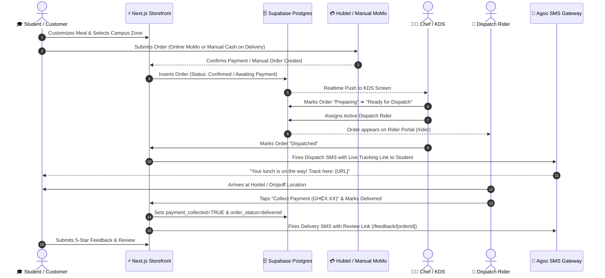
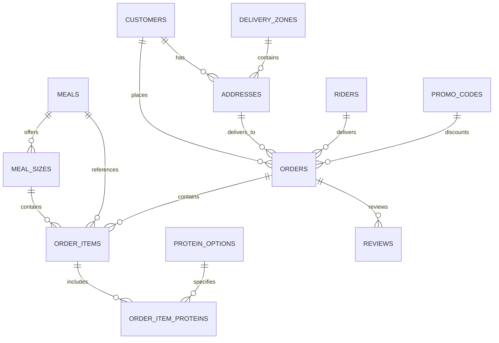

<div align="center">

# 🍔 CHEF APEDO FOODS
### *Campus Delivery OS & High-Throughput Cloud Kitchen Platform*

> **An end-to-end, real-time culinary logistics platform engineered specifically for the University of Ghana, Legon campus community.**

[](https://nextjs.org/)
[](https://www.typescriptlang.org/)
[](https://tailwindcss.com/)
[](https://supabase.com/)
[](https://hubtel.com/)
[](https://agoosms.com/)
[](https://vercel.com/)

<p align="center">
  <a href="#-core-architecture--features">Architecture</a> •
  <a href="#-system-flow-diagram">System Diagram</a> •
  <a href="#-delivery-zones--pricing">Campus Zones</a> •
  <a href="#-database-schema">Database</a> •
  <a href="#-api-endpoints">API Reference</a> •
  <a href="#-local-development">Quickstart</a>
</p>

---

</div>

## 📖 Executive Overview

**Chef Apedo Foods** is a vertically integrated, full-stack food delivery application designed to handle high-volume campus food rushes with zero friction. It bridges the entire culinary lifecycle:
1. **Students** customize meals and place orders with instant dynamic campus delivery fees.
2. **Kitchen Staff** monitor real-time orders via an auto-updating Kitchen Display System (KDS).
3. **Dispatch Couriers** navigate deliveries and enforce physical cash/MoMo collection verification.
4. **Automated Engines** fire transactional SMS alerts, collect customer reviews, and broadcast promotional blasts via the Agoo SMS gateway.

---

## 🏗️ Core Architecture & Features

```
Chef Apedo Foods Architecture
│
├── 📱 Customer Storefront (/)
│   ├── Cinematic Splash & Brand Motion Hero
│   ├── Design B Full-Bleed Meal Cards with High-Contrast Overlays
│   ├── Deep Customization (Portion Size → Protein Packages → Extra Portions)
│   ├── Dynamic Campus Zone Delivery Pricing (Evandy, Pentagon, Main Campus, East Legon)
│   ├── Dual-Payment Split (Food Prepaid Online / Delivery Paid to Rider)
│   └── Real-Time Order Tracking (/order/[id]) with Packing Celebration Animation
│
├── 🍳 Kitchen Display System (/admin)
│   ├── WebSocket-Powered Realtime Order Queue (Supabase Channels)
│   ├── One-Tap State Progression: Awaiting Payment ➔ Preparing ➔ Ready ➔ Dispatched
│   ├── Courier Dispatch Assignment & Status Sync
│   ├── Live Kitchen Capacity & Availability Toggles
│   ├── Menu & Stock Management (/admin/menu)
│   ├── Financial Ledger & Reconciliation (/admin/finance)
│   └── Mass SMS Broadcast Marketing Engine (/admin/marketing)
│
├── 🛵 Rider Logistics Portal (/rider)
│   ├── Secure Phone-Based Courier Authentication
│   ├── Filtered Active Dispatch Queue (Couriers see only their assigned deliveries)
│   ├── 1-Tap Google Maps GPS Navigation & Direct Phone Dialing
│   └── Mandatory "Collect Payment" Confirmation Gate for Cash / MoMo Reconciliation
│
└── 💬 Automated Customer Feedback & Review Loop (/feedback/[orderId])
    ├── Post-delivery automated SMS with individualized feedback link
    └── 1-5 Star interactive rating & qualitative dish critique system
```

---

## 🔄 System Flow Diagram



---

## 📍 Dynamic Campus Delivery Zones & Pricing

Chef Apedo delivers fresh midday staples directly to hostel gates and faculty points across the University of Ghana and surrounding Accra zones:

| Campus Zone / Delivery Area | Courier Fee (Pesewas) | Display Amount | Transit Time Guarantee |
|:---|:---:|:---:|:---:|
| 🏢 **Evandy Hostel** | `500` | **GH₵ 5.00** | 10 – 15 mins |
| 🏢 **Pentagon Hostels (Blocks A–D)** | `500` | **GH₵ 5.00** | 10 – 15 mins |
| 🏛️ **Main Campus (Balme / Night Market / Halls)** | `700` | **GH₵ 7.00** | 15 – 20 mins |
| 🌆 **East Legon / Shiashie / Bawaleshie** | `1000` | **GH₵ 10.00** | 20 – 30 mins |
| ✈️ **Airport Residential Area** | `1200` | **GH₵ 12.00** | 25 – 35 mins |
| 🏙️ **Osu / Cantonments / Labone** | `1500` | **GH₵ 15.00** | 30 – 40 mins |
| 🛣️ **Spintex / Batsonaa** | `2000` | **GH₵ 20.00** | 35 – 45 mins |

> [!NOTE]
> **Strict Operational Ceiling:** 7 areas outside central coverage (*Kasoa, Teshie, Nungua, Ashaiman, Chorkor, Mamprobi, Abokobi*) are strictly excluded at checkout to ensure all food arrives steaming hot.

---

## 🗄️ Database Architecture & Migrations

The database is built on PostgreSQL inside **Supabase**, secured with Row Level Security (RLS) policies:



### Key Tables & Schema Definitions

| Table | Description | Critical Columns |
|:---|:---|:---|
| `orders` | Master order records | `id`, `customer_id`, `address_id`, `order_status`, `payment_status`, `subtotal_pesewas`, `delivery_fee_pesewas`, **`payment_collected`**, `rider_id`, `promo_code_id` |
| `riders` | Authorized dispatch staff | `id`, `name`, `phone`, `active`, `current_lat`, `current_lng` |
| `promo_codes` | Marketing discounts | `id`, `code`, `discount_percentage`, `max_uses`, `current_uses`, `active` |
| `reviews` | Customer ratings & critique | `id`, `order_id`, `rating`, `comment`, `customer_name`, `created_at` |
| `delivery_zones` | Geographic pricing tiers | `id`, `name`, `areas` (text[]), `fee_pesewas`, `active` |
| `meals` | Food catalog items | `id`, `name`, `description`, `available` |
| `meal_sizes` | Small / Medium / Large pricing | `id`, `meal_id`, `size`, `base_price_pesewas` |
| `kitchen_settings` | Real-time kitchen limits | `id`, `is_kitchen_open`, `daily_order_capacity`, `updated_at` |

---

## 📡 API Route Catalog

| Endpoint | Method | Role | Description |
|:---|:---:|:---:|:---|
| `/api/orders/manual` | `POST` | Public | Submits a new guest order with dynamic delivery fee & promo calculation |
| `/api/payments/hubtel` | `POST` | Public | Initializes online mobile money checkout via Hubtel API |
| `/api/webhooks/hubtel` | `POST` | Gateway | Secure server-to-server webhook for Hubtel payment verification |
| `/api/admin/orders` | `GET` | Admin / KDS | Fetches active live order queue with customer and address relations |
| `/api/admin/orders/[id]` | `PATCH` | Admin / KDS | Updates order status (`preparing`, `dispatched`, `delivered`) |
| `/api/admin/orders/[id]/assign` | `POST` | Admin / KDS | Assigns an active delivery rider to an order |
| `/api/admin/orders/[id]/payment-collected` | `PATCH` | Admin / Rider | Sets `payment_collected: true` and `payment_status: paid` for manual orders |
| `/api/admin/marketing` | `POST` | Admin | Broadcasts promotional SMS blast to all customers via Agoo SMS API |
| `/api/promos/validate` | `POST` | Public | Validates a discount code and calculates percentage off base food subtotal |
| `/api/reviews` | `POST` | Public | Submits verified customer star rating and dish feedback |

---

## 🛠️ Local Development Setup

### 1. Prerequisites
- **Node.js** v18+ or v20+ LTS
- **npm** or **pnpm**
- A **Supabase** project account

### 2. Clone & Install
```bash
git clone https://github.com/your-username/chefapedofoods.git
cd chefapedofoods
npm install
```

### 3. Environment Variables Configuration
Create a `.env.local` file in the root directory:

```env
# Application Base URL
NEXT_PUBLIC_APP_URL="http://localhost:3000"

# Supabase Authentication & Database
NEXT_PUBLIC_SUPABASE_URL="https://your-project.supabase.co"
NEXT_PUBLIC_SUPABASE_ANON_KEY="your-anon-public-key"
SUPABASE_SERVICE_ROLE_KEY="your-service-role-secret-key"

# Payments (Hubtel Gateway)
HUBTEL_CLIENT_ID="your_hubtel_client_id"
HUBTEL_CLIENT_SECRET="your_hubtel_client_secret"
HUBTEL_MERCHANT_ACCOUNT_NUMBER="your_merchant_number"

# Messaging (Agoo SMS Gateway)
SMS_API_KEY="agoo_live_your_active_api_key"
SMS_SENDER_ID="CHEF APEDO"
```

### 4. Database Initialization
Execute the SQL migrations located in `supabase/migrations/` in sequential order:
```bash
# Apply migrations via Supabase CLI or SQL Editor:
0001_initial_schema.sql
0002_kitchen_display_and_tracking.sql
0003_scaling_features.sql
0004_marketing_and_promos.sql
0005_financial_reconciliation.sql
```

### 5. Run the Dev Server
```bash
npm run dev
```
Visit **`http://localhost:3000`** in your browser.

---

## 🛡️ Business Rules & Integrity Guarantees

1. **Integer Pesewas Standard:** Floating-point numbers are strictly forbidden for currency. Every figure is handled as an integer (e.g., `GH₵ 45.00` = `4500` pesewas).
2. **Dual-Lane Payment Split:** Food total is prepaid online (Hubtel) or via manual merchant MoMo transfer; delivery fees are paid directly to the courier on delivery. These two sums are never displayed as a single merged charge.
3. **Mandatory Delivery Payment Gate:** Riders cannot finalize an order as "Delivered" without confirming physical cash/MoMo collection via the `/rider` verification dialog.
4. **Capacity & Same-Day Cutoff:** Ordering closes at **10:00 AM GMT** for same-day delivery slots. Orders are strictly capped at daily kitchen capacity to guarantee culinary quality.

---

<div align="center">

### Chef Apedo Foods · Midday Excellence for Legon Campus
*Handcrafted with pride in Accra, Ghana · Engineered by Godwin Apedo*

</div>
